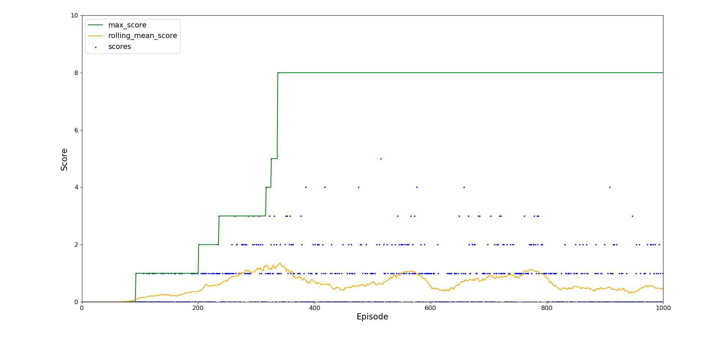
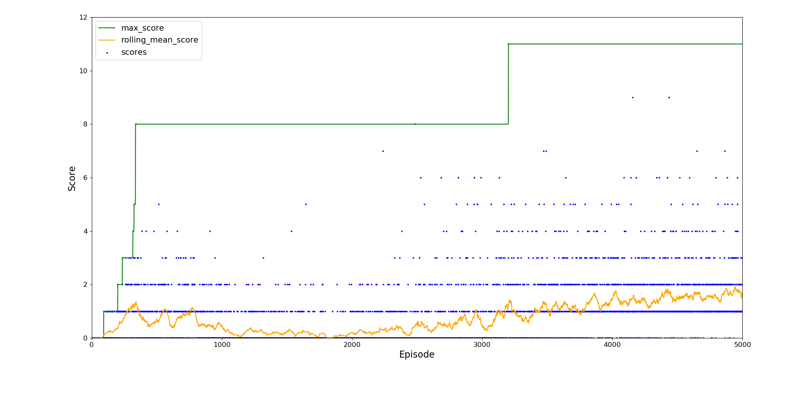
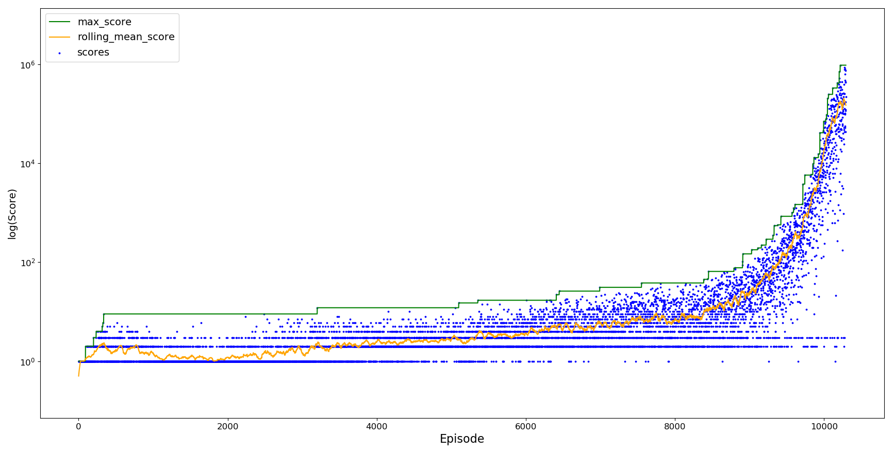
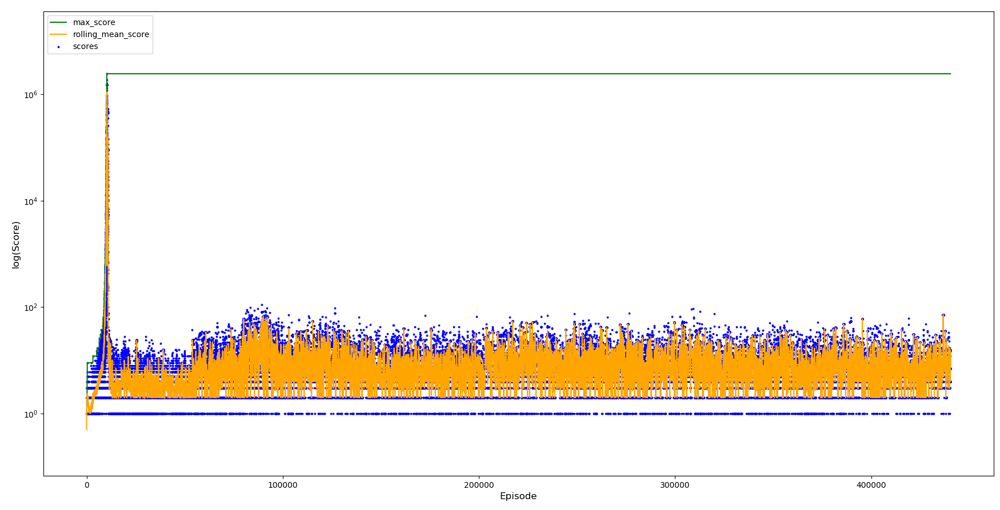
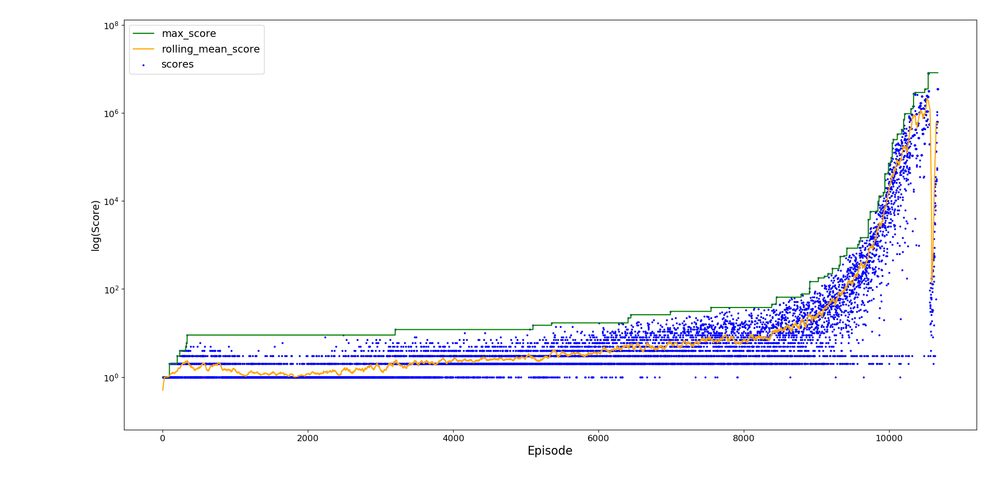
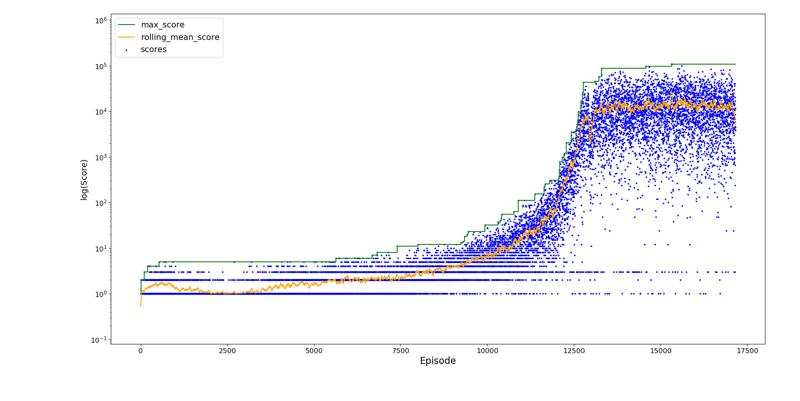
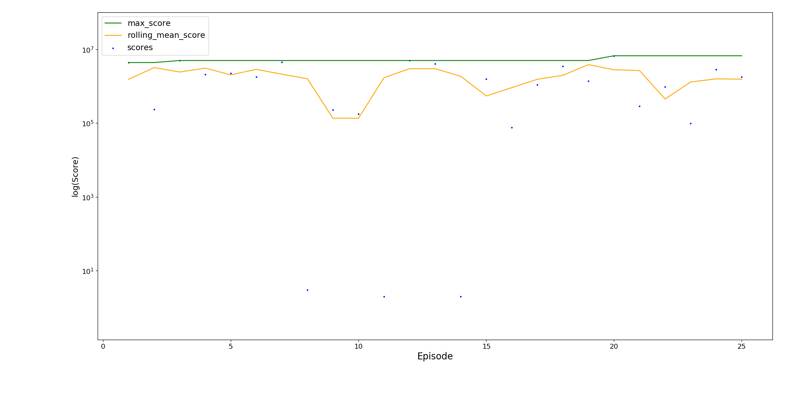

# FlapPyBird-RL

Exploration implementing reinforcement learning using [Q-learning](https://en.wikipedia.org/wiki/Q-learning) in [Flappy Bird](https://en.wikipedia.org/wiki/Flappy_Bird).

## Results

The reward function penalises -1000 for a death and 0 otherwise, such that the agent focuses on not dying. This make the agent goal to get as high a score as possible vs e.g. naively rewarding +1 for a score increase which means the agent would only maximise the chance of getting more than 1000. 
Through undertaking this project the most difficult part was defining a good reward function and how this links to the agent learning.

The score rolling mean is averaged over a window of 50 using [numpy.convolve](https://docs.scipy.org/doc/numpy/reference/generated/numpy.convolve.html) and `mode='same'` to keep boundary effects visible.

### Initial Training

The agent was initially trained for around 10,000 episodes without any exploration and the learning rate alpha kept constant at 0.7. 

<p align="left">
     
     
</p>

Slowly but surely the agent is learning.

<p align="left">
     
</p>

After around 10,000 episodes the agent is almost able to reach a score of 1 million. The y-axis has been logged so that the rolling increase in score can be seen more clearly.

### Experience Replay: Catastrophic Forgetting

Although the initial training performed well, it was very slow to improve further - it takes a very long time for it to reach a scenario it fails at. 
By introducting experience replay the agent can attempt the difficult scenario multiples times to attempt to overcome it. 
The lenght of replay was set to 70 (the distance between pipes), and it tries until it passes the difficult scenario or appears to be stuck in a resume loop (100 attempts). 
Upon passing the difficult scenario, upon failure it restarts from the beginning to avoid the maximum score reached from continously increasing.

Load the Q-table and continue from the initial training but with experience replay.

<p align="left">
     
</p>

There is an initial improvement in agent learning as it encounters difficult scenarios more often, but its performance quickly drops and remains below the peak reached. 

When trying to overcome the rarer scenarios the agent has 'forgotten' what was originally learnt, leading to a drop in agent performance as it fails to return to the previously generalisable action states. 
This is known as catastrophic forgetting which typically leads to an oscillation in agent performance as it unlearns and relearns the optimal actions to take. 
However, this has been compounded by repeatedly learning from the same scenario failure, leading to overfitting of the problem where the agent is unable to return to the optimal path in the learning space.

### Experience Replay: Replay Buffer

To overcome catastrophic forgetting, alpha is decayed as the agent is trained, helping it to retain the information it learn early on whilst still learning from rarer scenarios. 
In addition, the number of attempts to be considered stuck in a loop is reduced to 50 and during experience replay we create a 'replay buffer' with all the actions taken in the attempts to overcome a scenario. 
The Q-table is updated from this in a mini-batch fashion, sampling 5 of attempts remaining once the agent has overcome the scenario or is considered stuck in a reply loop. 
To avoid overfitting the agent doesn't replay the scenario until success, and the resume score is set to a high value (100,000 in this case) so as not to overfit more commonly encountered scenarios. 

<p align="left">
     
</p>

This agent is almost able to reach a score of 10 million. Although a drop in performance is observed as training continues past episode 10,000, it is able to recover from this initial forgetting. 
Whilst futher time is not spent training this agent, it could be expected that the agent performance would oscillate as it unlearns and relearns the optimal actions to take, and that it wouldn't completely forget how to reach the optimum as we saw in catastrophic forgetting. As alpha continues to decay this should eventually enable the agent to remain stable around its maximum score.

### Epsilon Greedy Policy

We now try freshly trained agent, introducing the exploration rate epsilon that gives a chance to explore a random action until it decays from 0.1 to 0 after 10,000 episodes, and alpha decay which decays alpha from 0.7 to 0.1 after 20,000 episodes.

<p align="left">
     
</p>

Due to the alpha and epsilon decay, this agent learns slower than the initial training but is much more stable once it has reached its optimum performance just below 1 million. 
This maximum score is lower than we experienced without exploration, perhaps due alpha decaying during training such that by the time agent has almost completed its exploration period it is difficult for it to learn more. 
For this agent (only 2 possible states of flap or no flap) and environment (repeating), it is likely that it is the alpha decay and not the ability to explore providing the stability observed.

### Validation

From above we can see the final best performing agent was trained with experience replay and a replay buffer. 
Agent performance was validated over 25 runs.

<p align="left">
     
</p>

The agent performs well, consistently passing 100,000 and reaching a maximum score above 5 million. 
It is able to pass most situations but is unable to live forever when more difficult scenarios appear, meaning it sometimes dies quite early on. 

- Stability: The coefficient of variation (standard deviation / mean) is 0.967.
This is expected since in a random environment the agent can only be fully stable once it can overcome every scenario and never die.
- Average score: The average score is 2,001,434.
This is a strong score for the agent to consistently be able to reach, surpassing any human play.
- Maximum score: The maximum score reached in 25 runs is 6,720,279.
This is a high score close to the default maximum training value of 10 million, again surpassing any human play.

### Future Work

- Longer training times - the best performing agent was trained for a total of 15 hours and only reached 10,674 episodes
- Implement [prioritized experience replay](https://arxiv.org/abs/1511.05952)
- Train an agent which never dies in the Flappy Bird environment

## Getting Started

Added modules:
- [anaysis.py](analysis.py) Analysis file for investigating agent performance
- [config.py](config.py) Config file for changing the agent training parameters
- [flappy_rl.py](flappy_rl.py): [FlapPyBird](https://github.com/sourabhv/FlapPyBird) implementation with agent training/runner code included
- [q_learning.py](q_learning.py): An implementation of a Q-learning agent class made with reference to [rl-flappybird](https://github.com/kyokin78/rl-flappybird)

Change the training parameters in [config.py](config.py) and run the [flappy_rl.py](flappy_rl.py) module.

## Development

[q_learning.py](q_learning.py)
- Q-learning is performed based upon the states [x0, y0, vel, y1], where x0 and y0 are the player distances to the next lower pipe, 
vel is the agent y velocity, and y1 is the y distance between the lower pipes. x0, y0, y1 are calculated from the playerx, playery, and the array of lower pipes
- States are added to the Q-table as they are encountered rather than initialising a sparse Q-table.
The initial state is initialised to [0, 0, 0] where the array represents [Q of no action, Q of flap action, Times experienced this state]
- Alpha (learning date) decay is added to prevent overfitting and reduce the chance of catastrophic forgetting as training continues
- An epsilon greedy policy to give a chance to explore has been added but commented out. It was found that 
exploration is not efficient or required for this agent (only 2 possible states, flap or no flap) and environment (repeating)
- Improved performance by adding functions to reduce the number of moves in memory for updating the Q-table, 
and to update the Q-table and end the episode if the maximum score is reached (default 10 million)

[flappy_rl.py](flappy_rl.py)
- Removed sounds, welcome animation, and game over screen to improve performance
- Added the ability to perform runs without game rendering, greatly improving runtime
- Added the ability to resume the game from 70 frames (distance between pipes) before death
- For visibility, the current score the agent has reached is printed and updated every score interval of 10,000
This enables the agent to learn to overcome scenarios not often encountered. 
Once the agent has overcome this scenario, upon its next death it restarts training from the beginning to avoid the maximum score reached from continuously increasing

## Forked From [FlapPyBird](https://github.com/sourabhv/FlapPyBird)

A Flappy Bird Clone made using [python-pygame][pygame]

### How-to (as tested on MacOS)

1. Install Python 3.x (recommended) 2.x from [here](https://www.python.org/download/releases/)

2. Install [pipenv]

2. Install PyGame 1.9.x from [here](http://www.pygame.org/download.shtml)

3. Clone the repository:

```bash
$ git clone https://github.com/sourabhv/FlapPyBird
```

or download as zip and extract.

4. In the root directory run

```bash
$ pipenv install
$ pipenv run python flappy.py
```

5. Use <kbd>&uarr;</kbd> or <kbd>Space</kbd> key to play and <kbd>Esc</kbd> to close the game.

(For x64 windows, get exe [here](http://www.lfd.uci.edu/~gohlke/pythonlibs/#pygame))

### Notable forks

- [FlappyBird Fury Mode](https://github.com/Cc618/FlapPyBird)
- [FlappyBird Model Predictive Control](https://github.com/philzook58/FlapPyBird-MPC)
- [FlappyBird OpenFrameworks Port](https://github.com/TheLogicMaster/ofFlappyBird)

Made something awesome from FlapPyBird? Add it to the list :)

### ScreenShot


[pygame]: http://www.pygame.org
[pipenv]: https://pipenv.readthedocs.io/en/latest/
