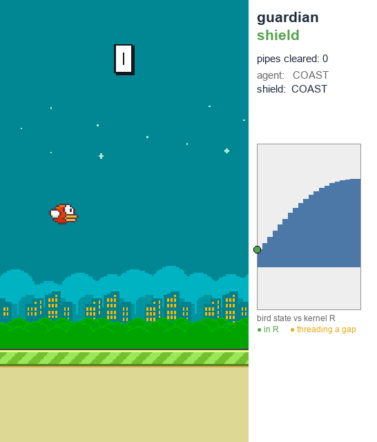
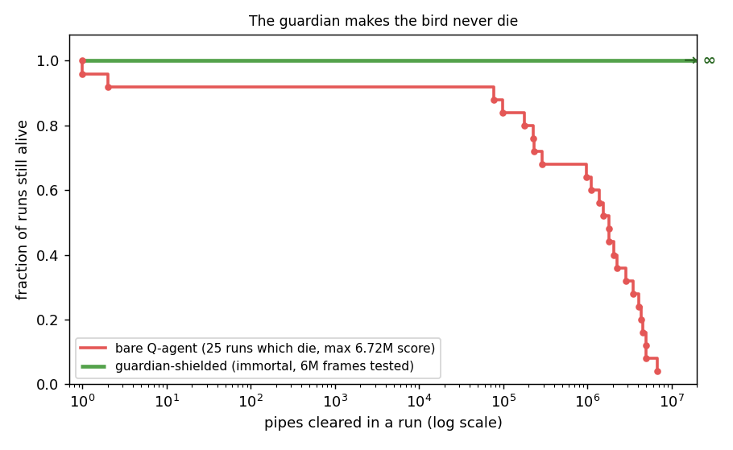
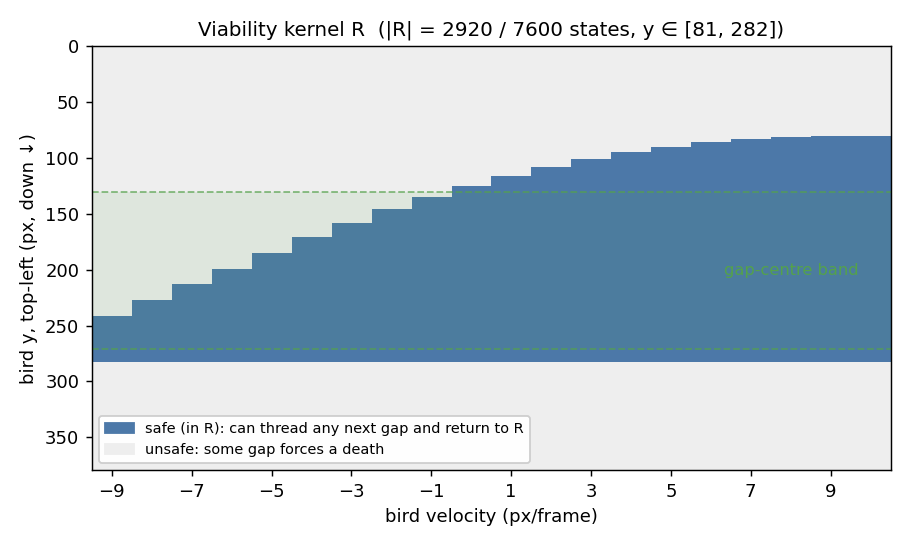
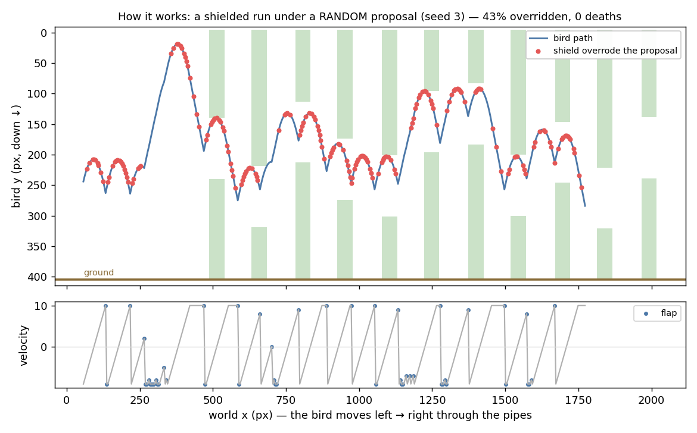
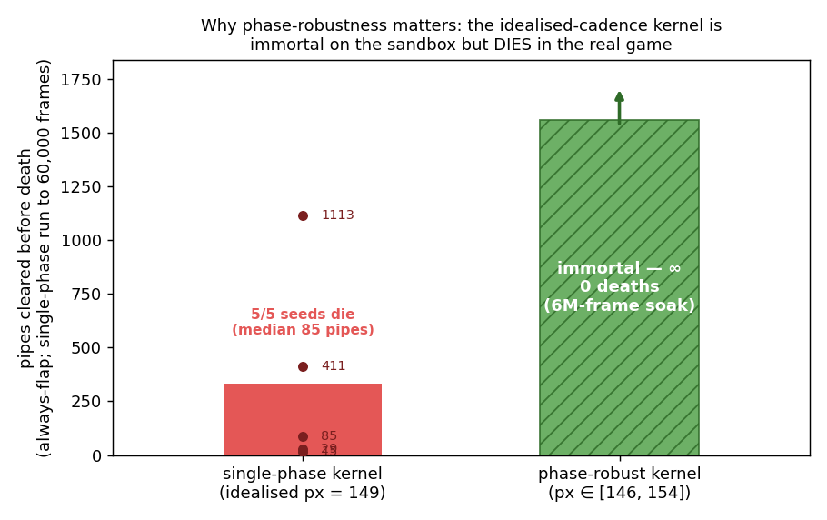
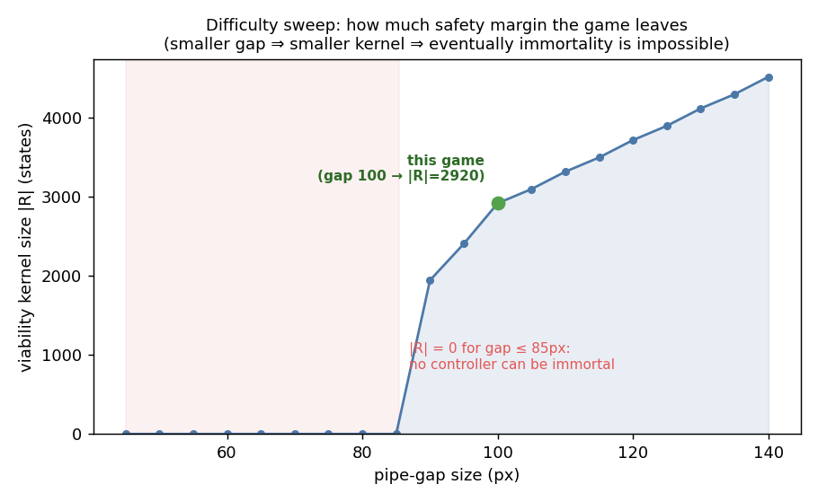
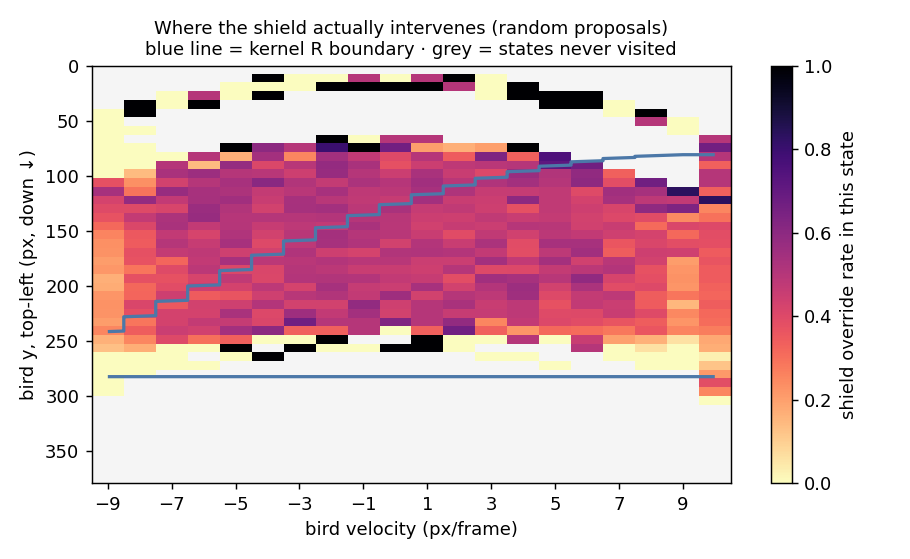
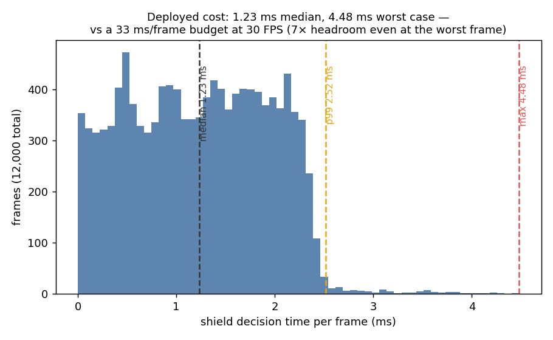

# guardian
A model-based safety layer that makes the Flappy Bird agent never die.

The `guardian` wraps the existing RL agent (Q-learning / DQN) with a reachability shield backed by an offline robust viability kernel. The shield overrides agent actions which would lead to a death, using only information onscreen.

---

## Results

Driven by the pygame engine's exact physics, the shield is immortal under all proposed actions, including adversarial ones. The worse the proposal, the more the shield intervenes.

| proposal policy | shield override rate | deaths (~15k pipes, 500k frames) |
|---|---:|---:|
| trained Q-agent | 2 % | 0 |
| always no-flap | 8 % | 0 |
| adversary (aims for the far gap extreme) | 5 % | 0 |
| random | 42 % | 0 |
| always flap | 91 % | 0 |

### Watch it play

A live run under a random proposal, rendered from the actual [pygame engine](viz/render_gif.py), shows the random proposal being overwritten where `SHIELD OVERRIDE` ensures the bird's `(velocity, y)` state can always reach the survivability kernel `R`.

> Random proposals are used to demonstrate the shield firing often.

<p align="left">
    
</p>

The originally trained Q-agent is strong, but now we've take it to immortality.

<p align="left">
    
</p>

### The viability kernel

The viability kernel `R` is the set of `(y, velocity)` states the bird can pass every possible pipe RNG and return to a state in `R`. 2920 out of 7600 possible states are in `R`, which shrinks as downward velocity grows (extreme velocities are harder to recover from).


<p align="left">
    
</p>

### How it works

A shielded run under a random proposal shows the bird trajectory in blue with the shield overriding the proposed action in red with zero deaths. When run online, we perform a backwards sweep per frame that determines if the bird can fit through the current pipe and return to the kernel - this is the bulk of the compute cost.

<p align="left">
    
</p>

### Governing pipes

The main pygame engine spawns each pipe at a fixed screen x and scrolls it to the left, and a pipe's x at which it becomes the governing pipe `pipe0` is one of {146, 148, 154} rather than an idealised 149. By quantifying the kernel over the range of possible states we properly encode this into the states in the kernel.

<p align="left">
    
</p>

### Other findings 

By sweeping the range of possible pipe gaps, we find that it is possible to achieve immortality under our current pygame engine settings. It's impossible to train an agent which never dies at pipe gaps smaller than 85px.

<p align="left">
    
</p>

The guardian shield intervenes more often in `(velocity, y)` states near the kernel boundary which makes sense as more extreme velocities and heights are harder to recover from if a difficult pipe sequence arises.

<p align="left">
    
</p>

The added time per-frame for the shield is 1.2 ms median and 4.5ms in the worst case, well within the 33ms/frame budget for the game to run smoothly. This tells us that the AlphaZero-style net distillation is probably overengineering for this simple environment (see [Notes](#notes)).

<p align="left">
    
</p>

---

## Getting Started

To try it, turn it on in [config.py](../config.py) (`'use_shield': True`) and run `python src/flappy_rl.py`. 

> The shield is active in RUN mode only so that training is unaffected.

All of the following can be run from [src/train_guardian.py](../train_guardian.py). The [viability kernel](kernel.npy) is already trained and included.

```bash
# from the repo root (numpy is required; torch only for the optional net training)
python -m src.guardian.viability  # (re)build kernel.npy
python -m src.guardian.viz.results  # regenerate the static figures in results/
python -m src.guardian.viz.render_gif  # regenerate the demo GIF in results/
```

To visualise the results:

- `python -m src.guardian.viz.results` reruns the real game under adversarial proposals and writes all the figure options to `results/`. To render just one the options are - `kernel, overrides, phase, trajectory, survival, sweep, heatmap, or latency`.
- `python -m src.guardian.viz.render_gif` renders the animated gif with the kernel visualization.

---

## Package layout

| file | role |
|------|------|
| **Viability Kernel** | |
| `config.py` | imports engine physics/geometry from `src/game_params.py`; adds guardian's derived + tuning constants (gap band, phase band, planner/net) |
| `dynamics.py` | pure `bird_step`, `scroll`, `clearance`, `features`; velocity and position stay integers, so the states are exact |
| `viability.py` | builds the offline robust viability kernel `R` (exact fixed-point on the integer lattice) |
| `realtime.py` | the online honest controller + `GameAdapter` (for live runs) |
| `kernel.npy` | the precomputed kernel `R` (bundled; rebuilt by `viability.py`) |
| **Render** | |
| `viz/results.py` | regenerates every static figure in this writeup |
| `viz/render_gif.py` | renders the demo GIF from the real pygame renderer + overlay |
| **AlphaZero / distillation (optional)** | |
| `planner.py` | `center_seeking_action` (smooth greedy expert), `shield`/`survivable`, `assert_passable` (checks every gap is individually reachable) |
| `env.py` | headless env (training / eval only) |
| `search.py` | depth-limited robust safety search (optional AlphaZero scaffolding) |
| `nets.py` | PyTorch actor-critic for the distilled policy (optional) |
| `expert_iteration.py` | warm start + on-policy DAgger loop that distils a fast reactive policy from the shielded expert (optional, off the critical path) |
| `numpy_verify.py` / `dagger_verify.py` | torch-free reproductions of the distillation / training math (no PyTorch) |

---

## Distilled policy (optional)

We now try to move the safety off the per-frame search and into a fast learned policy. We distill an optional net from a shielded expert - a `center_seeking_action` controller guarded by a short-horizon safety check (`planner.shield`). The net learns to reproduce that expert's action in a single forward pass, so a proposal no longer needs a per-frame reachability search. The net is far cheaper to run but no longer immortal so we still run the viability kernel with `'use_shield': True`.

```bash
python -m src.guardian.expert_iteration  # (re)outputs data/guardian_policy.pt  (needs torch)
```
```python
from guardian.nets import load_policy
from guardian.realtime import GameAdapter

net, shield = load_policy(), GameAdapter()  # data/guardian_policy.pt + bundled kernel
action = shield.action(playery, playerVelY, lowerPipes, net.act)  # net proposes, shield guarantees
```

Results from one run (5 seeds, 20k-frame cap):

| stage | policy CE (cross entropy loss) | bare-net survival (pipes, per seed) | shield override rate |
|---|---:|---|---:|
| warm | 0.015 | 45 / 28 / 101 / 18 / 20 | 0.1 % |
| DAgger | 0.004 | 117 / 27 / 58 / 38 / 140 | 0.0 % |

The warm stage behaviour-clones the net from our shielded expert. An on-policy DAgger (dataset aggregation) stage then refines it on the states the net actually visits, driving CE to ~0.004 so the shield overrides it on only ~0.1% of frames.

If we dropped the immortality guarantee of the viability kernel, this single forward pass (~0.08 ms/frame) would replace the per-frame reachability sweep (~1.2 ms/frame) at roughly 16× cheaper compute. Whilst this isn't a huge deal for simpler environments like this one, it earns its place in non-deterministic problems such as systems with hidden information, other players, or stochastic physics.
